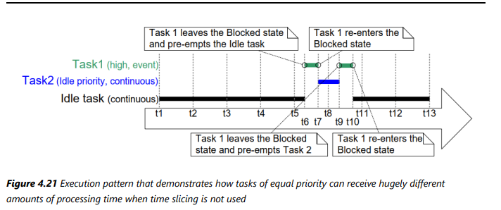

# Mastering the FreeRTOS Real Time Kernel v1.1.0

## 4. Task Management 

### 4.1 ~ 4.2
- Task 는 작은 프로그램임. Entry Point를 가지고 보통 무한루프를 돔.
- Task 는 `(void *)`를 파라미터로 가지고 `return` Statement가 없어야함 

`void vATaskFunction( void * pvParams);`

Task Function 하나로 여러개의 task를 생성할 수 있으며 각각의 Task는 각각의 메모리 영역(Stack + TCB)를 가지게 됨

``` c
// Example Code
void vTask1( void * pvParameters )
{
    /* ulCount is declared volatile to ensure it is not optimized out. */
    volatile unsigned long ulCount;
    for( ;; )
    {
        /* Print out the name of the current task task. */
        vPrintLine( "Task 1 is running" );
        /* Delay for a period. */
        for( ulCount = 0; ulCount < mainDELAY_LOOP_COUNT; ulCount++ )
        {
            /*
            * This loop is just a very crude delay implementation. There is
            * nothing to do in here. Later examples will replace this crude
            * loop with a proper delay/sleep function.
            */
        }
    }
}
```

### 4.3 Top Level Task States

테스크는 크게 `Running`, `Not Runnging` 상태를 가지는데 `Running` 은 CPU를 점유하고 있는 Task를 뜻하고 `Not Running`은 그 외를 뜻함

*<i class="fa fa-info-circle" aria-hidden="true"></i>* 멀티 코어에서는 여러개의 Task 가 동시에 작동할수 있다고 함

### 4.4 Task Creation

Task를 생성하기 위해서는 아래 Function 중 하나를 사용하면 됨
가장 기본적인 것은 `xTaskCreate()`

```c
xTaskCreate(), xTaskCreateStatic(),
xTaskCreateRestricted(), xTaskCreateRestrictedStatic(), 
xTaskCreateAffinitySet(), xTaskCreateStaticAffinitySet()
```

해당 Function에 포함되어 있는 키워드의 뜻은 다음과 같음

- **Static** : 동적 메모리 할당을 하지 않고 사용자가 스택 메모리를 할당

|항목 | xTaskCreate() | xTaskCreateStatic()|
|------|----------|--------|
|**메모리 방식**        | 동적 할당 (heap)    | 정적 할당 (stack or global memory)|
|**메모리 실패 가능성**  | 있음 (heap 부족 시)  | 없음 (미리 확보)|
|**안정성**            | 낮음                | 매우 높음|
|**주요 사용 분야**     | 일반 시스템          | 실시간/안전성 필수 시스템|

<details close>
    <summary>예제</summary>

```c

    #define STACK_SIZE 256

    StaticTask_t xTaskBuffer;
    StackType_t xStack[STACK_SIZE];

    void vMyTask(void *pvParameters)
    {
        for( ;; )
        {
            // 무한 루프
        }
    }

    void createTask(void)
    {
        xTaskCreateStatic(
            vMyTask,              // 실행할 함수
            "MyTask",             // 태스크 이름
            STACK_SIZE,           // 스택 크기 (words)
            NULL,                 // 인자
            tskIDLE_PRIORITY + 1, // 우선순위
            xStack,               // 스택 버퍼
            &xTaskBuffer          // TCB 버퍼
        );
    }
```

</details>

- - -

- **Restricted**: Restricted가 붙으면 시스템 메모리에 제한된 엑세스로 실행이 됨. Restricted가 없으면 `Privileged mode` 로 전체 메모리에 엑세스 가능함
`Memory Protection Unit(MPU)` 이 있는 `Port`에서 사용된다고 함
태스크가 자기 메모리 외에 다른 태스크 메모리를 못 건드리게 막을 수 있음.
<details close>
    <summary>예제</summary>

`xMemoryRegions` 를 정확하게 Define 해줘서 제한된 메모리만 Access함
```c
static const MemoryRegion_t xMemoryRegions[] =
{
    { (void *)0x20000000, 0x1000, portMPU_REGION_READ_WRITE },  // RAM 일부 영역
    { (void *)0x08000000, 0x1000, portMPU_REGION_READ_ONLY },   // 플래시 읽기 전용
    { NULL, 0, 0 } // 나머지는 비워야 함
};

static const TaskParameters_t xTaskParameters =
{
    .pvTaskCode = vTaskFunction,
    .pcName = "RestrictedTask",
    .usStackDepth = 256,
    .pvParameters = NULL,
    .uxPriority = 2,
    .puxStackBuffer = xStackBuffer,
    .xRegions = xMemoryRegions
};

void createRestrictedTask(void)
{
    xTaskCreateRestricted( &xTaskParameters, NULL );
}
```
</details>

- - -

- **AffinitySet** : `Symmetric Multi Processing(SMP) `은 여러개의 Task가 동시에 여러개의 코어에서 돌아가게 하는 것인데 어떤 Core에서 Task를 돌릴지 지정하는 함수.

- - -

#### 4.4.1 xTaskCreate 함수
가장 무난한 TaskCreate 함수는 아래처럼 생김

```c
BaseType_t xTaskCreate( TaskFunction_t pvTaskCode,
                        const char * const pcName,
                        configSTACK_DEPTH_TYPE usStackDepth,
                        void * pvParameters,
                        UBaseType_t uxPriority,
                        TaskHandle_t * pxCreatedTask );
```

`pvTaskCode` : Task Function 의 function pointer (그냥 이름)
`pcName` : 디버깅용 테스크 이름 (FreeRTOS는 이걸 사용하지 않는다고 한다)
`usStackDepth` : Task가 사용할 Stack의 크기 in words. 별도로 설정하지 않으면 최대 Stack은 65535 (적당한 Stack 크기는 어떻게 얻지..)
`pvParameters` : task 의 파라미터 array의 포인터  
`uxPriority` : Task의 `Priority`
`pxCreatedTask` : Task Handler 포인터

<details close>
    <summary>예제</summary>

```c
int main( void )
{
    /*
    * Variables declared here may no longer exist after starting the FreeRTOS
    * scheduler. Do not attempt to access variables declared on the stack used
    * by main() from tasks.
    */
    /*
    * Create one of the two tasks. Note that a real application should check
    * the return value of the xTaskCreate() call to ensure the task was
    * created successfully.
    */
    xTaskCreate( vTask1, /* Pointer to the function that implements the task.*/
                "Task 1",/* Text name for the task. */
                1000, /* Stack depth in words. */
                NULL, /* This example does not use the task parameter. */
                1, /* This task will run at priority 1. */
                NULL ); /* This example does not use the task handle. */
    /* Create the other task in exactly the same way and at the same priority.*/
    xTaskCreate( vTask2, "Task 2", 1000, NULL, 1, NULL );
    /* Start the scheduler so the tasks start executing. */
    vTaskStartScheduler();
    /*
    * If all is well main() will not reach here because the scheduler will now
    * be running the created tasks. If main() does reach here then there was
    * not enough heap memory to create either the idle or timer tasks
    * (described later in this book). Chapter 3 provides more information on
    * heap memory management.
    */
    for( ;; );
}
```
코드 실행시키면 이런식으로 Task가 돌아가면서 실행된다.
```Bash
C:\Temp>rtosdemo
Task 1 is running
Task 2 is running
Task 1 is running
Task 2 is running
Task 1 is running
Task 2 is running
Task 1 is running
Task 2 is running
Task 1 is running
Task 2 is running
Task 1 is running
Task 2 is running
Task 1 is running
Task 2 is running
```


</details>

- - -

- `Task` 안에서 `Task` 생성하는것도 가능하다

### 4.5 Task Priorities

- `Priority`는 값이 낮을수록 우선순위가 낮고 0 ~ (`configMAX_PRIORITIES – 1`) 까지 가능
- `Generic Scheduler`는 `configMAX_PRIORITIES` 값에 대한 제한은 없지만 값이 클수록 성능과 메모리에 안좋다. 모든 `Port` 에서 사용가능
- `Architecture-Optimized Scheduler` 는 말 아키텍쳐에 따라 32, 64까 지 `configMAX_PRIORITIES` 값 설정이 가능하지만 이것도 마찬가지로 값이 클수록 메모리에 안좋다. 특정 `Port` 에서 사용가능

### 4.6 Tick Interrupts 
- 동일한 `Priority`를 가지는 `Task` 들은 설정된 `configTICK_RATE_HZ` 의 Time slice 만큼 도는데 보통 `configTICK_RATE_HZ` 는 100Hz(10ms)로 많이 설정된다. 


### 4.7 Expanding the `Not Running State`

- `Not Running State`은 세부적으로 `Blocked State`, `Suspended State`, `Ready State` 로 나눠진다
- `Blocked State`은 `Temporal (time-related) events (시간 관련)` 을 기다리거나 `Synchronization Event(동기화)` 를 기다리는 상태를 의미한다. 
- 시간 관련 이벤트는 말그대로 지연시간이 만료되거나 절대적인 시간이 만료되었을 때를 의미함
- 동기화 이벤트는 다른 Task나 인터럽트로 부터 발생하는 이벤트다.(queue, semaphore, mutuex, message buffer, etc)
- `Suspended State`는 `vTaskSuspend()` API function으로 설정할수 있으며 Scheduler가 접근못함. 보통 안씀
-  `Ready State`는 말그대로 실행가능한 Task. `Blocked` 되거나 `Suspended` 되지 않은 `Not running Task`


- 위 예시처럼 의미없는 For Loop 를 돌리면서 다음 Time Slice를 기다리는 방식(Polling)은 CPU time을 낭비해서 좋지않다. 그래서 `vTaskDelay()`를 사용하여 Task를 `Blocked State`로 만드는게 좋다. 그러면 아래처럼 효율적이게 됨


- `vTaskDelayUntil()` 함수는 `vTaskDelay()`햠수는 해당 함수가 불렸을 때 부터 일때에 반해 `vTaskDelayUntil()`는 Task가 실행되고 나서의 시간을 재기 때문에 더 정확하다.

<details close>
    <summary>vTaskDelayUntil() 쓰는방법</summary>
Task 1 : P2 
- Task2의 Priority를 Task1의 priority 보다 1높임

Task 2 : P1 
- 자신의 Priority를 2낮춤


```c
void vTaskFunction( void * pvParameters )
{
    char * pcTaskName;
    TickType_t xLastWakeTime;
    /*
    * The string to print out is passed in via the parameter. Cast this to a
    * character pointer.
    */
    pcTaskName = ( char * ) pvParameters;
    /*
    * The xLastWakeTime variable needs to be initialized with the current tick
    * count. Note that this is the only time the variable is written to
    * explicitly. After this xLastWakeTime is automatically updated within
    * vTaskDelayUntil().
    */
    xLastWakeTime = xTaskGetTickCount();
    /* As per most tasks, this task is implemented in an infinite loop. */
    for( ;; )
    {
        /* Print out the name of this task. */
        vPrintLine( pcTaskName );
        /*
        * This task should execute every 250 milliseconds exactly. As per
        * the vTaskDelay() function, time is measured in ticks, and the
        * pdMS_TO_TICKS() macro is used to convert milliseconds into ticks.
        * xLastWakeTime is automatically updated within vTaskDelayUntil(), so
        * is not explicitly updated by the task.
        */
        vTaskDelayUntil( &xLastWakeTime, pdMS_TO_TICKS( 250 ) );
    }
}

```

</details>
- - -


#### 4.8 Idle Task

- Running State인 Task가 항상 하나는 있어야 하기때문에 Idle Task가 존재한다.
- Idle Task는 그래서 우선순위가 가장 낮다(0).
- 사용자가 우선순위가 0인 Task를 생성할수도 있는데 TODO...
- 우선순위가 낮은 Task가 CPU 점유가 뺏기는걸 `Preemption` 이라고 함
- vTaskDelete()로 자기 자신을 삭제한 태스크의 자원 회수는 Idle 태스크가 담당함
- Idle 태스크가 실행될 수 있는 시간이 반드시 보장되어야 한다. 그렇지 않으면 자원 누수(memory leak)나 시스템 불안정이 발생할 수 있다.
- 그에 따라서 Idle Hook 함수(Idle Task 실행할때 설정가능한 사용자 설정 함수)에서는 Blocking 함수 사용 금지, 오래 걸리지 않도록 구현이 필요하다.

- Idle Hook 함수는 특별해서 API가 정해져있다
```c
void vApplicationIdleHook( void );
```

#### 4.9 Changing the Priority of a Task
- 스케쥴러가 시작한 후 Task의 우선순위를 바꿀수도 있다. 아래는 Priority getter와 setter.
- Task 안에서 본인의 Priority를 바꾸고자 하면 `xTask` 파라미터에 NULL을 넣으면 된다.
```c
void vTaskPrioritySet( TaskHandle_t xTask, UBaseType_t uxNewPriority );

UBaseType_t uxTaskPriorityGet( TaskHandle_t xTask );
```

<details close>
    <summary>실행중 Task Priorty 바꾸는 예제</summary>

```c

void vTask1( void * pvParameters )
{
    UBaseType_t uxPriority;
    /*
    * This task will always run before Task 2 as it is created with the higher
    * priority. Neither Task 1 nor Task 2 ever block so both will always be in
    * either the Running or the Ready state.
    */
    /*
    * Query the priority at which this task is running - passing in NULL means
    * "return the calling task's priority".
    */
    uxPriority = uxTaskPriorityGet( NULL );
    for( ;; )
    {
    /* Print out the name of this task. */
    vPrintLine( "Task 1 is running" );
    /*
    * Setting the Task 2 priority above the Task 1 priority will cause
    * Task 2 to immediately start running (as then Task 2 will have the
    * higher priority of the two created tasks). Note the use of the
    * handle to task 2 (xTask2Handle) in the call to vTaskPrioritySet().
    * Listing 4.25 shows how the handle was obtained.
    */
    vPrintLine( "About to raise the Task 2 priority" );
    vTaskPrioritySet( xTask2Handle, ( uxPriority + 1 ) );
    /*
    * Task 1 will only run when it has a priority higher than Task 2.
    * Therefore, for this task to reach this point, Task 2 must already
    * have executed and set its priority back down to below the priority
    * of this task.
    */
    }
}

void vTask2( void * pvParameters )
{
    UBaseType_t uxPriority;
    /*
    * Task 1 will always run before this task as Task 1 is created with the
    * higher priority. Neither Task 1 nor Task 2 ever block so will always be
    * in either the Running or the Ready state.
    *
    * Query the priority at which this task is running - passing in NULL means
    * "return the calling task's priority".
    */
    uxPriority = uxTaskPriorityGet( NULL );
    for( ;; )
    {
    /*
    * For this task to reach this point Task 1 must have already run and
    * set the priority of this task higher than its own.
    */
    /* Print out the name of this task. */
    vPrintLine( "Task 2 is running" );
    /*
    * Set the priority of this task back down to its original value.
    * Passing in NULL as the task handle means "change the priority of the
    * calling task". Setting the priority below that of Task 1 will cause
    * Task 1 to immediately start running again – preempting this task.
    */
    vPrintLine( "About to lower the Task 2 priority" );
    vTaskPrioritySet( NULL, ( uxPriority - 2 ) );
    }
}
/* Declare a variable that is used to hold the handle of Task 2. */
TaskHandle_t xTask2Handle = NULL;
int main( void )
{
    /*
    * Create the first task at priority 2. The task parameter is not used
    * and set to NULL. The task handle is also not used so is also set to
    * NULL.
    */
    xTaskCreate( vTask1, "Task 1", 1000, NULL, 2, NULL );
    /* The task is created at priority 2 ______^. */
    /*
    * Create the second task at priority 1 - which is lower than the priority
    * given to Task 1. Again the task parameter is not used so is set to NULL-
    * BUT this time the task handle is required so the address of xTask2Handle
    * is passed in the last parameter.
    */
    xTaskCreate( vTask2, "Task 2", 1000, NULL, 1, &xTask2Handle );
    /* The task handle is the last parameter _____^^^^^^^^^^^^^ */
    /* Start the scheduler so the tasks start executing. */
    vTaskStartScheduler();
    /*
    * If all is well main() will not reach here because the scheduler will
    * now be running the created tasks. If main() does reach here then there
    * was not enough heap memory to create either the idle or timer tasks
    * (described later in this book). Chapter 2 provides more information on
    * heap memory management.
    */
    for( ;; )
    {
    }
}

```

</details>

#### 4.10 Deleting a Task

- `vTaskDelete()` API function을 사용하여 Task를 삭제할 수 있으나 지속적으로 Task를 생성하고 삭제하는게 좋은 디자인은 아니다. 
  - 메모리 누수, 성능저하, 어려운 디버깅 등.
- Idle Task가 Task에게 할당된 메모리 등을 Free하는 역활을 함.

#### 4.11 Thread Local Storage and Reentrancy

- `Thread Local Storage` : TCB 내에 있는 Task 독립적인 저장공간 (Task 가 독립적으로 가지고 있는 전역 변수라고 생각하면 편함)
- 왜 굳이 전역 변수를 쓸까? 그냥 Stack(로컬변수) 를 쓰면 안될까? => 가장 현실적인 예로 두 Task가 하나의 함수에서 동일한 static 변수를 사용할때 Race Condition 이 문제가 될수가 있다. 이를 방지하기 위해 TLS 필요
- 이와 같이 여러 Task 가 실행시 문제가 될수 있는 함수를 `Non-Reentrant function` 이라고 한다.
- 그 반대로 여러 Task 가 실행시에도 문제가 안되는 함수를 `Reentrant function`이라고 한다.

- 아래 매크로를 설정하여 TLS 설정할수 있고 Getter와 Setter를 사용하여 값을 변경할수 잇다.
`configUSE_C_RUNTIME_TLS_SUPPORT`
`configTLS_BLOCK_TYPE`
`configINIT_TLS_BLOCK`
`configSET_TLS_BLOCK`
`configDEINIT_TLS_BLOCK`

```C
TaskGetThreadLocalStoragePointer( TaskHandle_t xTaskToQuery,BaseType_t xIndex )
void vTaskSetThreadLocalStoragePointer( TaskHandle_t xTaskToSet,BaseType_t xIndex,void * pvValue );
```


#### 4.12 Scheduling Algorithms


1. `Preemptive With Time Slicing` : 보통 이 방식을 사용. 우선순위가 더 높은 애가 Ready 상태시 바로 CPU 점유함. 동일 우선순위끼리는 Time slicing(Tick Interrupt) 을 통해 Round Robin 방식으로 작동. 
   


1. `Preemptive Without Time Slicing` : 우선순위가 더 높은 애가 Ready 상태시 바로 CPU 점유함. Running Task가 `Tick Interrupt` 없이 Yielding(Task가 CPU 점유를 포기해야함(Suspended or Blocked State 진입). 숙련된 사용자만 사용하는 것을 권유


1. `Co-Operative` : 우선순위가 더 높은 애가 Ready 상태시 바로 CPU 점유하지 않고 Running Task가 CPU 점유를 포기해야지 그때 Ready 상태의 Task 중 가장 높은 Priority의 Task 를 실행시킴. 이 방식을 사용하면 Preemptive 방식을 사용했을때 보다 동시적으로 자원을 점유해야하는 상황에서 발생하는 문제들을 피하기 쉽다.(Preemptive방식에서는 이런 문제들을 피하기 위하여 Queue, Semaphore 등을 사용한다.)


